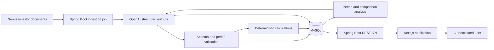

# SenusBoard

SenusBoard is an AI-native Board reporting platform for Senus PLC. It turns published financial documents into a private, interactive view of reported results, deterministic financial metrics, period comparisons, source documents, and AI-generated commentary.

The platform is designed for Management, Board members, Equity Investors, and Credit Providers. It presents the same governed dataset to every ordinary user while changing the category order to reflect each audience's priorities.

## Product Overview

SenusBoard provides five main experiences:

- **Period Reports** present Growth, Profitability, Liquidity, and Capital metrics for a selected reporting period.
- **Period Comparison** compares supported equivalent periods without mixing full-year and half-year performance.
- **Source Documents** expose the document metadata, AI summary, and controlled download used to support the report.
- **AI-generated analysis** provides period-level and comparison commentary from stored financial data.
- **Administration** supports registration review, account creation, account search, access removal, and user deletion.

The product follows several data-integrity principles:

- Reported values, deterministic calculations, and AI-generated narrative remain structurally and visually distinct.
- Missing or ambiguous values remain unavailable and are never converted to zero.
- Financial calculations are performed by application code rather than by the language model.
- AI extraction is restricted to the fixed reporting schema and must preserve accounting signs and source units.
- AI commentary receives only stored reported values and deterministic calculations; it does not produce forecasts or unsupported causal claims.
- Full-year periods are compared only with full-year periods, and half-year periods only with equivalent half-year periods.

The detailed product scope, metric selection, source validation, and known data limitations are recorded in [Requirements](documents/development_logs/Requirements.md). Page behaviour and presentation rules are defined in the [Final Frontend Design](documents/development_logs/FrontendDesignFinal.md).

## Architecture



The repository contains two independently runnable applications backed by one database:

- The **Spring Boot backend** exposes versioned REST APIs, enforces authentication and account state, serves source documents, and runs a separate non-web ingestion profile.
- The **Next.js frontend** provides the public welcome experience, authenticated Board reports, comparisons, document access, and administration screens.
- **MySQL** stores reporting periods, source metadata, reported category values, deterministic calculations, AI analysis, comparison analysis, ingestion history, and users.
- **OpenAI structured outputs** are used during ingestion for fixed-schema extraction and constrained narrative analysis. User-facing data requests read persisted results and do not wait for model generation.

Browser API requests use the Next.js `/api` rewrite, which forwards them to Spring Boot while retaining a same-origin browser flow. Access tokens are held in frontend memory, refresh tokens use an HttpOnly cookie, and Server-Sent Events notify connected clients when account access is revoked.

Detailed decisions are available in the [Database Design](documents/development_logs/DatabaseDesign.md), [API Design](documents/development_logs/APIDesign.md), [Authentication Design](documents/development_logs/AuthenticationDesign.md), [AI Extraction Job Design](documents/development_logs/AIExtractionJob.md), and [Final Frontend Design](documents/development_logs/FrontendDesignFinal.md).

## Technology Stack

| Area | Technologies |
| --- | --- |
| Frontend | TypeScript, Next.js 16, React 19, Tailwind CSS 4 |
| Backend | Java 25, Spring Boot 4, Spring Web, Spring Data JPA |
| Security | Spring Security, JWT access and refresh tokens, Server-Sent Events |
| Database | MySQL, Flyway migrations |
| AI integration | OpenAI API, strict JSON Schema structured outputs |
| Validation and mapping | Jakarta Validation, Jackson |
| Build and quality | Maven Wrapper, npm, ESLint, JUnit, Mockito, Spring MVC tests |

Technology choices and the intended AWS EC2, Nginx, and Amazon RDS deployment topology are summarised in [Development Progress](documents/development_logs/Progress.md). Deployment configuration is not currently included in this repository.

## Repository Structure

```text
SenusBoard/
├── backend/                       Spring Boot API and ingestion application
│   ├── src/main/java/             Application, security, data, and AI pipeline code
│   ├── src/main/resources/        Configuration, prompts, schemas, and migrations
│   └── src/test/                  Backend automated tests
├── frontend/                      Next.js application
│   ├── app/                       App Router pages and shared layouts
│   ├── features/                  Authentication, dashboard, and Admin features
│   ├── service/                   Backend API clients
│   ├── types/                     Shared API and domain types
│   └── utils/                     Formatting utilities
└── documents/
    └── development_logs/          Requirements and technical design records
```

Backend setup and execution instructions belong in the [Backend README](backend/README.md). Frontend setup and execution instructions belong in the [Frontend README](frontend/README.md).

## AI-Assisted Development Workflow

Development followed a staged workflow in which the developer remained responsible for requirements, design decisions, review, and acceptance of the resulting system.

At every stage, the working pattern was:

1. **Functional design:** AI assisted with analysis and alternatives; the final functional design was completed and approved by the developer.
2. **Architecture design:** AI assisted with architecture options and trade-offs; the final architecture was completed and approved by the developer.
3. **Code implementation:** AI implemented the approved design.
4. **Automated testing:** AI created and ran automated checks for the implementation.
5. **Manual testing:** The developer exercised and reviewed the completed behaviour.

The stages were completed in this order:

| Stage | Functional and architecture records | Implementation focus |
| --- | --- | --- |
| Requirements analysis | [Requirements](documents/development_logs/Requirements.md) | Product goals, audiences, source validation, available metrics, and limitations |
| Database design | [Database Design](documents/development_logs/DatabaseDesign.md) | Fixed financial schema, relationships, write rules, calculations, and AI analysis storage |
| Backend: extraction job | [AI Extraction Job Design](documents/development_logs/AIExtractionJob.md) | Source discovery, document ingestion, structured extraction, persistence, calculations, and analysis |
| Backend: API and security | [API Design](documents/development_logs/APIDesign.md) and [Authentication Design](documents/development_logs/AuthenticationDesign.md) | Financial data APIs, document delivery, JWT authentication, account policy, and Admin operations |
| Frontend | [Initial Frontend Design](documents/development_logs/FrontendDesignInitial.md) and [Final Frontend Design](documents/development_logs/FrontendDesignFinal.md) | Routes, permissions, report presentation, comparisons, document access, and administration |

[Development Progress](documents/development_logs/Progress.md) provides the consolidated record of the project sequence and major technology decisions. AI-produced implementation and tests were treated as reviewable engineering output rather than as evidence of correctness on their own.

## Core User Flows

### Authentication and access

An ordinary user registers with an allowed enterprise email domain and receives `PENDING` status. Pending and active users may sign in and use the reporting platform. An Admin can approve, reject, disable, or delete an ordinary account. Rejection or disablement is enforced on every protected request and is also sent to the active frontend through an authenticated event stream.

The complete account lifecycle, password rules, token behaviour, permissions, and endpoint policy are specified in the [Authentication Design](documents/development_logs/AuthenticationDesign.md).

### Period reporting

The dashboard loads backend-defined reporting periods, selects the default period, and displays all four financial categories. Each metric retains its reported or calculated classification, missing values display as unavailable, and AI narrative is presented separately from numeric facts.

### Period comparison

The comparison experience supports `FY2024` against `FY2025` and `HY2025` against `HY2026`. The frontend retrieves both complete period datasets and the corresponding persisted comparison analysis. It does not permit arbitrary or mismatched period pairs.

### Source documents

Authenticated users can view ingested source metadata and download an available local source file through a document ID. The API resolves the stored path and never accepts or exposes a client-supplied filesystem path.

The response contracts and supported comparison rules are documented in the [API Design](documents/development_logs/APIDesign.md). Route behaviour and role-aware presentation are documented in the [Final Frontend Design](documents/development_logs/FrontendDesignFinal.md).

## AI-Native Data Pipeline

The ingestion process runs through a dedicated Spring profile and is separate from the web server lifecycle:

1. Discover and download supported documents from the configured Senus investor-relations source.
2. Create source metadata and a traceable ingestion run.
3. Upload each document for strict-schema extraction of reported values and a source summary.
4. Validate dates, canonical reporting periods, supported fields, duplicates, signs, and null handling.
5. Upsert reported category rows and calculate derived metrics with decimal application logic.
6. Build a complete persisted dataset and request constrained analysis for each reporting period.
7. Construct supported comparison pairs in application code, calculate numeric changes deterministically, and request narrative comparison analysis.
8. Persist analysis so normal API requests remain deterministic and independent of AI-provider latency.

Documents are processed sequentially. A document failure is recorded and stops the remaining batch. Reported and calculated data remain intact if a later analysis request fails. Detailed transaction boundaries, update precedence, security controls, prompts, schemas, retry policy, and operational constraints are defined in the [AI Extraction Job Design](documents/development_logs/AIExtractionJob.md).

## Financial Data Integrity

SenusBoard uses a fixed schema derived from available Senus disclosures. It currently covers:

- Growth: revenue and equivalent-period revenue growth.
- Profitability: gross profit, margins, operating result, cost of sales, and administrative expenses.
- Liquidity: cash, operating cash flow, working capital, current balances, capital expenditure, free cash flow, and liquidity ratios.
- Capital: bank debt, loan movement, interest expense, net assets, and net cash.

Reported values are stored exactly as reported in EUR base units with accounting signs preserved. Calculated values are produced only when every required input is available and the denominator is valid. Unsupported measures are not invented: for example, EBITDA-based measures, reliable debt-service coverage, and ROCE remain unavailable without adequate source inputs and an approved calculation policy.

The source assessment and metric-specific limitations are documented in [Requirements](documents/development_logs/Requirements.md). Calculation formulas, persistence rules, and table relationships are defined in the [Database Design](documents/development_logs/DatabaseDesign.md).

## Validation and Testing

Validation occurs at several boundaries:

- OpenAI responses must satisfy strict JSON Schema before application-level processing.
- The backend aligns exact date ranges to supported canonical periods and rejects invalid or duplicate period data.
- Deterministic calculations retain nulls for missing inputs and zero denominators.
- Comparison pairs are selected and validated by application code rather than by the model.
- Backend tests cover services, controllers, security filters and handlers, JWT behaviour, Admin bootstrap, calculations, extraction persistence, source discovery, comparison analysis, and the OpenAI client boundary.
- Frontend quality checks use ESLint and a production Next.js build.
- Manual testing validates the completed user flows, access behaviour, interactions, and presentation against the approved functional designs.

Automated tests reduce implementation risk. The developer's manual review covers implemented workflows, access behaviour, and user experience. The implemented data-validation rules are described in [Requirements](documents/development_logs/Requirements.md), [AI Extraction Job Design](documents/development_logs/AIExtractionJob.md), and [Authentication Design](documents/development_logs/AuthenticationDesign.md).

## Assumptions and Limitations

- The initial fixed schema supports the verified annual and half-year periods described in the requirements record.
- Only `FY2024 → FY2025` and `HY2025 → HY2026` are supported comparison pairs.
- Later non-null extraction values replace earlier values for the same period; later nulls do not erase existing values.
- Individual financial values do not retain field-level page references, extraction confidence, or validation status.
- The ingestion job processes documents sequentially and has no source-priority policy for conflicting documents.
- AI narrative is interpretation of supplied data, not a forecast, recommendation, or substitute for the source disclosure.

The rationale and complete boundaries are maintained in [Requirements](documents/development_logs/Requirements.md), [Database Design](documents/development_logs/DatabaseDesign.md), and [AI Extraction Job Design](documents/development_logs/AIExtractionJob.md).

## Documentation

- [Development Progress](documents/development_logs/Progress.md) - project sequence, technology choices, and intended deployment topology.
- [Requirements](documents/development_logs/Requirements.md) - product goals, source research, metric selection, assumptions, and limitations.
- [Initial Frontend Design](documents/development_logs/FrontendDesignInitial.md) - initial category and visualisation design.
- [Database Design](documents/development_logs/DatabaseDesign.md) - schema, relationships, calculations, analytics tables, and write rules.
- [AI Extraction Job Design](documents/development_logs/AIExtractionJob.md) - ingestion stages, structured output, validation, persistence, and analysis.
- [API Design](documents/development_logs/APIDesign.md) - financial data endpoints, response contracts, comparisons, and source documents.
- [Authentication Design](documents/development_logs/AuthenticationDesign.md) - account lifecycle, credentials, tokens, permissions, and events.
- [Final Frontend Design](documents/development_logs/FrontendDesignFinal.md) - final routes, access rules, page behaviour, and frontend data flow.
- [Backend README](backend/README.md) - backend configuration, execution, testing, and operations.
- [Frontend README](frontend/README.md) - frontend configuration, execution, routes, and development guidance.
